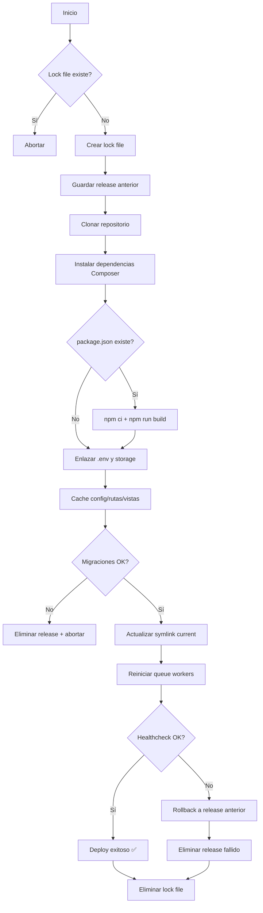

# Server Deploy — CI/CD para Laravel con GitHub Actions (Self-Hosted Runner)

Guía completa para configurar un pipeline de despliegue continuo de una aplicación **Laravel** usando un **runner self-hosted de GitHub Actions** dentro de una VPN, con deploys **zero-downtime** basados en releases y symlinks.

---

## Tabla de Contenidos

1. [Requisitos Previos del Servidor](#1-requisitos-previos-del-servidor)
2. [Instalación del Runner Self-Hosted](#2-instalación-del-runner-self-hosted)
3. [Estructura de Directorios](#3-estructura-de-directorios)
4. [Script de Despliegue (`deploy.sh`)](#4-script-de-despliegue-deploysh)
5. [Workflow de GitHub Actions (`deploy.yml`)](#5-workflow-de-github-actions-deployyml)
6. [Detección de Fallos y Rollback Automático](#6-detección-de-fallos-y-rollback-automático)
7. [Rollback Manual y Limpieza](#7-rollback-manual-y-limpieza)
8. [Concurrencia y Retención de Releases](#8-concurrencia-y-retención-de-releases)

---

## 1. Requisitos Previos del Servidor

### Sistema Operativo

- **Ubuntu 22.04 LTS** o similar.

### Usuario dedicado

Crear un usuario no-root para el runner (p.ej. `github-runner`) con permiso `sudo`:

```bash
sudo useradd -m -s /bin/bash github-runner
sudo passwd github-runner
sudo usermod -aG sudo github-runner
```

### PHP y extensiones

Instalar **PHP 8.2+** (Laravel 11 requiere PHP ≥ 8.2) y extensiones comunes:

```bash
sudo apt install php8.2 php8.2-xml php8.2-mbstring php8.2-zip \
  php8.2-curl php8.2-pdo-mysql php8.2-cli php8.2-fpm
```

### Composer

Instalar **Composer 2** globalmente (Laravel requiere Composer 2+).

### Servidor Web (Nginx/Apache)

Configurar el servidor web apuntando a `/var/www/app/current/public`. Asegurarse de que el usuario de Nginx (`www-data`) pueda leer los archivos y escribir en `storage/` y `bootstrap/cache/`:

```bash
sudo chown -R www-data:www-data /var/www/app/shared/storage /var/www/app/shared/bootstrap/cache
sudo chmod -R 775 /var/www/app/shared/storage /var/www/app/shared/bootstrap/cache
```

### SSH Keys

- Generar un par de claves SSH para `github-runner` y configurar acceso a GitHub (agregar la clave pública como **deploy key**).
- Permitir que el usuario se conecte a la EC2 vía VPN con `authorized_keys`.

### Otros paquetes

| Paquete | Uso |
|---|---|
| `git` | Clonado del repositorio |
| `node` / `npm` | Compilación de assets frontend (si aplica) |
| `mysql-client` / `pgsql` | Migraciones y backups de BD |

### Permisos de carpetas

La estructura `/var/www/app` contendrá `releases/`, `shared/` y `current` (symlink).

- En `shared/` crear `.env` y el directorio `storage/` **antes del primer deploy**.
- El `.env` **no va en git**. Permisos recomendados: `.env` → `644`, `storage/` → `775` propiedad `www-data`.

### Logs y Backups

- Habilitar **rotación de logs** (logrotate).
- Programar **backup de base de datos** (cron con `mysqldump`) antes de migraciones.

---

## 2. Instalación del Runner Self-Hosted

Instalar GitHub Actions Runner en la EC2 (dentro de la VPN) como servicio.

### Descarga e instalación

Ejecutar como usuario `github-runner`:

```bash
sudo su - github-runner

# Crear carpeta del runner
mkdir ~/actions-runner && cd ~/actions-runner

# Descargar runner (ver URL en Settings > Actions > New self-hosted runner)
curl -o actions-runner-linux-x64.tar.gz -L \
  https://github.com/actions/runner/releases/download/v2.321.0/actions-runner-linux-x64-2.321.0.tar.gz
tar xzf actions-runner-linux-x64.tar.gz

# Registrar el runner en GitHub (usar token de registro)
./config.sh --url https://github.com/ORG/REPO --token TU_TOKEN

# Probar manualmente (cancelar con Ctrl+C)
./run.sh
```

### Configurar como servicio (systemd)

```bash
# Desde la carpeta del runner
sudo ./svc.sh install github-runner
sudo ./svc.sh start
```

| Comando | Acción |
|---|---|
| `sudo ./svc.sh status` | Ver estado del servicio |
| `sudo ./svc.sh stop` | Detener el runner |
| `sudo ./svc.sh uninstall` | Desinstalar el servicio |

### Consideraciones de seguridad

> [!CAUTION]
> - Ejecutar el runner con un usuario **limitado** (`github-runner`), **nunca root**.
> - No almacenar secretos de producción en el runner. Usar **GitHub Secrets** o **AWS SSM Parameter Store**.
> - Actualizar regularmente el software del runner.

---

## 3. Estructura de Directorios

```
/var/www/app
├── current -> releases/20260101120000    # symlink a la release activa
├── releases/
│     ├── 20260101120000/
│     ├── 20260102090000/
│     └── ...
└── shared/
      ├── .env
      └── storage/
           ├── app/
           ├── logs/
           └── ...
```

| Directorio | Propósito |
|---|---|
| `releases/` | Cada deploy crea una carpeta con timestamp (p.ej. `20260101120000`) con todo el código de esa versión. |
| `shared/` | Recursos **persistentes** entre releases: `.env` (configuración) y `storage/` (subidas, cachés, logs). Se enlazan simbólicamente en cada release. |
| `current` | Symlink al release activo. Nginx apunta a `current/public`. Se actualiza de manera **atómica** (`ln -sfn`), cambiando instantáneamente la versión sin downtime. |

### Links simbólicos

En cada release nuevo, el script de despliegue crea los enlaces:

```bash
ln -s /var/www/app/shared/.env .env
ln -s /var/www/app/shared/storage storage
```

> [!IMPORTANT]
> Mantener `storage/` y `bootstrap/cache/` con permisos `775` y propiedad `www-data` para evitar problemas de permisos.

---

## 4. Script de Despliegue (`deploy.sh`)

El archivo [`deploy.sh`](deploy.sh) contiene el flujo completo de despliegue. Se ubica en `/var/www/app/deploy.sh` con permisos ejecutables.

### Flujo del script



### Resumen de pasos

1. **Lock de concurrencia** — Evita deploys simultáneos con un archivo `deploy.lock`.
2. **Clonar repositorio** — `git clone --depth 1` para obtener solo la rama actual.
3. **Dependencias PHP** — `composer install --no-dev --optimize-autoloader`.
4. **Assets frontend** *(opcional)* — Si existe `package.json`: `npm ci` + `npm run build`.
5. **Symlinks compartidos** — Enlaza `.env` y `storage/` desde `shared/`.
6. **Optimización Laravel** — `config:cache`, `route:cache`, `view:cache`.
7. **Migraciones** — `php artisan migrate --force`. Si falla, aborta sin cambiar `current`.
8. **Swap de symlink** — `ln -sfn` actualiza `current` al nuevo release (cambio instantáneo).
9. **Reinicio de colas** — `php artisan queue:restart`.
10. **Healthcheck** — Verifica `http://localhost/health`. Si falla, hace rollback automático.

> [!NOTE]
> Ver el archivo [`deploy.sh`](deploy.sh) para el código completo con manejo de errores y rollback integrado.

---

## 5. Workflow de GitHub Actions (`deploy.yml`)

El archivo [`deploy.yml`](deploy.yml) define el pipeline CI/CD. Se ubica en `.github/workflows/deploy.yml` del repositorio.

### Resumen del workflow

| Paso | Acción |
|---|---|
| **Check out code** | `actions/checkout@v4` |
| **Set up PHP** | `shivammathur/setup-php@v2` con PHP 8.2 |
| **Install dependencies** | `composer install --no-dev` |
| **Run tests** | `php artisan test --no-interaction --fail-on-warning` |
| **Build frontend** *(opcional)* | `npm ci && npm run prod` |
| **Deploy to Server** | Ejecuta `bash /var/www/app/deploy.sh` |

El workflow se dispara con `push` a la rama `main` y utiliza `runs-on: self-hosted` para ejecutarse en el runner dentro de la VPN.

> [!IMPORTANT]
> El runner debe tener **PHP, Composer y Node** ya instalados, ya que es el entorno donde se ejecutan todos los pasos.

> [!NOTE]
> Ver el archivo [`deploy.yml`](deploy.yml) para la configuración YAML completa.

---

## 6. Detección de Fallos y Rollback Automático

El script `deploy.sh` implementa rollback automático en dos escenarios:

### Fallo en migraciones

- **No** se actualiza el symlink `current`.
- Se elimina la carpeta del release fallido.
- La versión anterior sigue sirviendo sin cambios.

### Fallo en healthcheck

- Se revierte el symlink `current` al release anterior.
- Se elimina el release defectuoso.

### Healthcheck

Exponer un endpoint `/health` en Laravel que devuelva HTTP `200` cuando todo está OK (p.ej. usando [Spatie Health](https://spatie.be/docs/laravel-health)):

```bash
HTTP_STATUS=$(curl -s -o /dev/null -w "%{http_code}" http://localhost/health)
if [ "$HTTP_STATUS" != "200" ]; then
    echo "Health failed: $HTTP_STATUS"
    exit 1
fi
```

### Notificaciones (opcional)

Enviar notificaciones al completar el deploy, por ejemplo a Slack via webhook:

```bash
send_slack_message() {
  curl -X POST -H 'Content-type: application/json' \
       --data "{\"text\": \"$1\"}" "$SLACK_WEBHOOK_URL"
}

# Uso:
send_slack_message "Deploy finalizado: release $RELEASE. Estado: OK."
```

También se puede usar [slack-github-action](https://github.com/slackapi/slack-github-action) directamente en el workflow.

---

## 7. Rollback Manual y Limpieza

En caso de necesidad, estos comandos permiten intervención manual rápida:

| Acción | Comando |
|---|---|
| **Ver release actual** | `readlink /var/www/app/current` |
| **Revertir a release previa** | `PREV=$(ls -dt /var/www/app/releases/*/ \| head -2 \| tail -1) && ln -sfn "$PREV" /var/www/app/current` |
| **Eliminar release fallido** | `rm -rf /var/www/app/releases/20260103123000` |
| **Limpiar releases (mantener 5)** | `cd /var/www/app/releases && ls -dt */ \| tail -n +6 \| xargs rm -rf` |
| **Revertir BD (con backup)** | `mysql < backup_previo.sql` o `php artisan migrate:rollback` |

---

## 8. Concurrencia y Retención de Releases

### Bloqueo de concurrencia

El script `deploy.sh` usa un **lock file** (`deploy.lock`) para evitar deploys simultáneos. Alternativa con `flock`:

```bash
exec 200>/var/www/app/deploy.lock
flock -n 200 || { echo "Despliegue en progreso, abortando."; exit 1; }
```

### Retención de releases

Para no acumular cientos de carpetas, limpiar regularmente conservando solo las últimas **N** releases (p.ej. N=5):

```bash
cd /var/www/app/releases
ls -dt */ | tail -n +6 | xargs rm -rf
```

> [!TIP]
> Automatizar esta limpieza como una **tarea cron diaria** o incluirla al final del script de deploy.

---

## Archivos del Repositorio

| Archivo | Descripción |
|---|---|
| [`deploy.sh`](deploy.sh) | Script bash completo de despliegue con rollback integrado |
| [`deploy.yml`](deploy.yml) | Workflow de GitHub Actions para CI/CD |
| [`README.md`](README.md) | Esta documentación |
